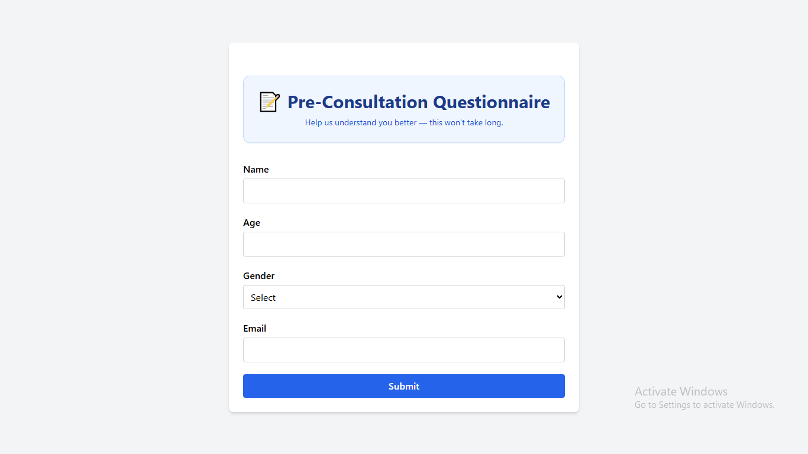
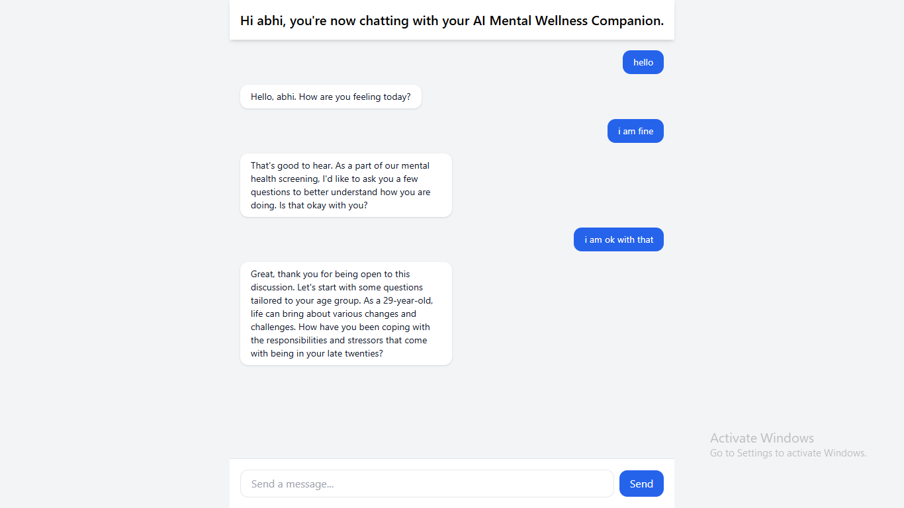

# 🤖 AI Assisted Mental Health Screening Application

## 🧠 Description

This project aims to expand existing mental health screening tools by introducing a **chatbot-based testing system**. The chatbot offers an engaging and adaptive interface tailored for both children and adults, helping to conduct mental health assessments effectively.
---

  

--- 

  

--- 

  

---

## ⚙️ Setup/Installation

> Follow the instructions in the `README.md` file for both forntend and backend.  
(Installation steps to be added here once implementation begins.)

---

## 🎯 Expected Outcome

- A chatbot interface that **dynamically adapts based on age group**
- **End-to-end mental health screening session** with rubric scoring
- **Context-aware LLM prompting** with memory of previous answers
- Backend with **RAG support**, **vector search**, and **model-agnostic design**
- A **production-ready codebase** with CI/CD and deployment-ready backend

---

## 🔧 Implementation Details

- **Frontend:** React.js  
- **Backend:** Python, FastAPI  
- **Database:** MongoDB with vector storage support  
- **RAG Models:** Model-agnostic (OpenAI, HuggingFace, etc.)  
- **Architecture:** Plugin-based backend with prompt templates and memory  
- **Screening Logic:** Rubric system mapped to answers with scoring logic  
- **Testing:** Unit testing + logging  
- **CI/CD:** GitHub Actions or similar  

---

